### 1. **How many pods exist on the system?**

```
	kubectl get pods --all-namespaces
```

```
kubectl get pods --all-namespaces --no-headers | wc -l
```

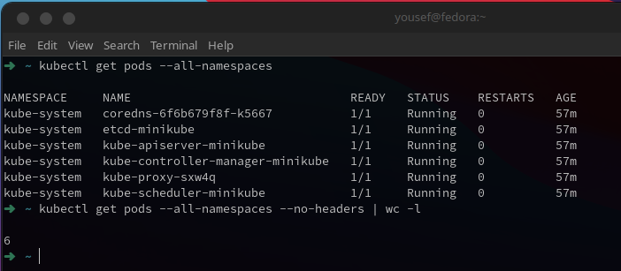

but this with namespaces so the answer is `0`
### 2. **How many nodes exist on the system?**

To list all the nodes in your Kubernetes cluster:
```
kubectl get nodes
```

To count the nodes:
```
kubectl get nodes --no-headers | wc -l
```

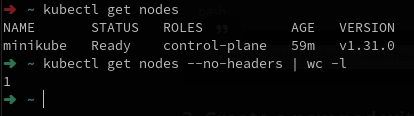
### 3. **Create a new pod with the nginx image**

You can create a pod with the `nginx` image using the `kubectl run` command:
```
kubectl run nginx-pod --image=nginx --restart=Never
```

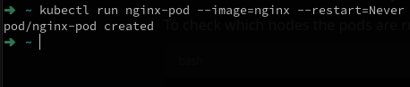

This will create a pod named `nginx-pod` with the `nginx` image.

### 4. **Which nodes are these pods placed on?**

To check which nodes the pods are running on, use:
```
kubectl get pods -o wide
```

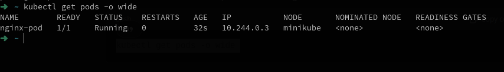

The output will display the `NODE` column, which indicates the node where each pod is running.
### 5. **Create a pod from a YAML file using `kubectl apply`**

webapp.yaml
```yaml
apiVersion: v1
kind: Pod
metadata:
  name: webapp
  namespace: default
spec:
  containers:
  - image: nginx
    imagePullPolicy: Always
    name: nginx
  - image: agentx
    imagePullPolicy: Always
    name: agentx
```

```
kubectl apply -f nginx-pod.yaml
```

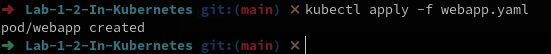
Created!
### 6. **How many containers are part of the `webapp` pod?**

To get the number of containers in the `webapp` pod, run:
```
kubectl get pod webapp -o jsonpath='{.spec.containers[*].name}' | wc -w
```

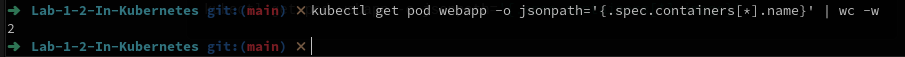

This will return `2`, indicating that there are two containers in the pod.
### 7. **What images are used in the `webapp` pod?**

To find out the images used in the pod:

```
kubectl get pod webapp -o jsonpath='{.spec.containers[*].image}'
```

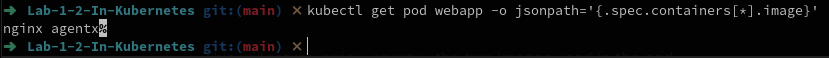

This will return `nginx agentx`, the two images used in the pod.
### 8. **What is the state of the container `agentx` in the `webapp` pod?**

To check the state of the container `agentx`:

```
kubectl get pod webapp -o jsonpath='{.status.containerStatuses[?(@.name=="agentx")].state}'
```

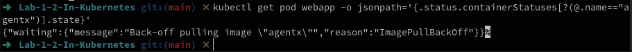

This will output the state of the `agentx` container (e.g., `Waiting`, `Running`, `Terminated`).
### 9. **Why do you think the container `agentx` in the `webapp` pod is in error?**

To find out why `agentx` is in error (if it is), you can check the logs:

```
kubectl logs webapp -c agentx
```

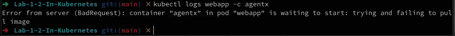
and it's error from the server!
### 10. **Delete the `webapp` Pod**

To delete the pod:

```
kubectl delete pod webapp
```

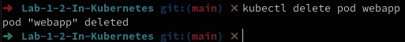
### 11. **Create a new pod with the name `redis` and the image `redis123`**

You can create this pod with the following command:

```
kubectl run redis --image=redis123 --restart=Never
```

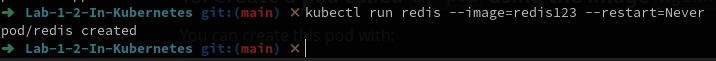
### 12. **Change the image on this pod to `redis`**

To update the image of the existing pod, you can use the `kubectl set image` command:
``
```
kubectl set image pod/redis redis=redis
```

Then, check if the pod is in a running state:

```
kubectl get pod redis
```

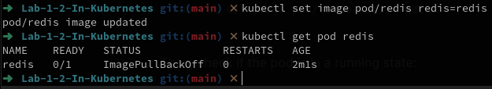
### 13. **Create a pod called `my-pod` using the image `nginx:alpine`**

You can create this pod with:

```
kubectl run my-pod --image=nginx:alpine --restart=Never
```

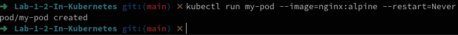
### 14. **Delete the pod called `my-pod`**

To delete the `my-pod` pod:

```
kubectl delete pod my-pod
```

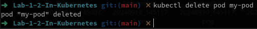
