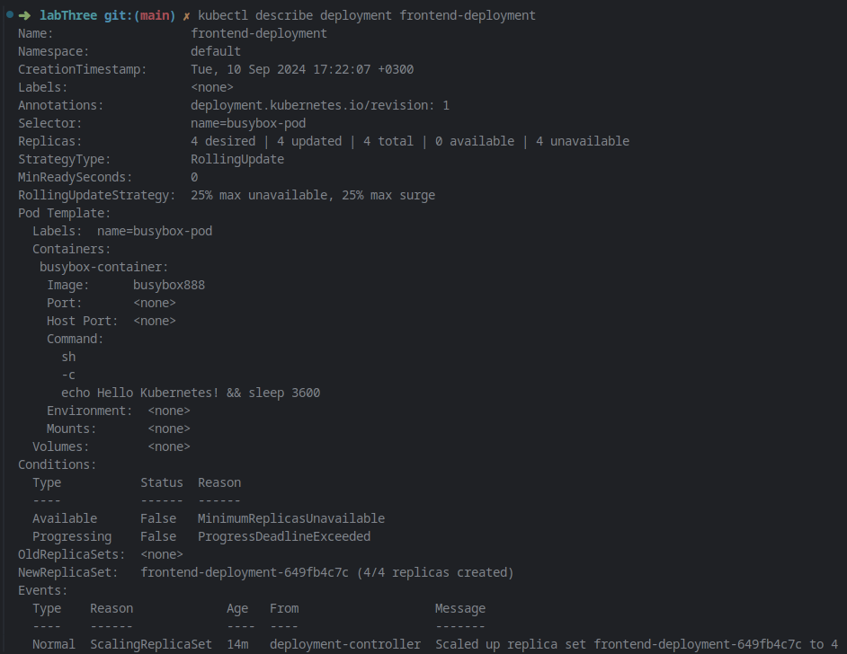

### 1. Create a Deployment called `my-first-deployment` of image `nginx:alpine` in the default namespace. Check to make sure the deployment is healthy.


Created a yaml file called my-first-deployment

**READY** column shows `1/1` for the pod to verify that it's healthy.

### 3. Scale `my-first-deployment` down to run 2 replicas.
```
kubectl scale deployment my-first-deployment --replicas=2
```

```
kubectl get deployment my-first-deployment
```


### 4. Change the image `my-first-deployment` runs from `nginx:alpine` to `httpd:alpine`.

```
kubectl set image deployment/my-first-deployment nginx-container=httpd:alpine
kubectl get deployment my-first-deployment
```

also check the status of the new pods to ensure they are running the `httpd:alpine` image:


### 5. Delete the deployment `my-first-deployment`.

```
kubectl delete deployment my-first-deployment
```


### 6. Create a deployment using the provided YAML:


### 7. How many ReplicaSets exist on the system now?


### 8. How many PODs exist on the system now?
get pods:


### 9. Out of all the existing PODs, how many are ready?
also use get pods:

### 10. What is the image used to create the pods in the new deployment?
The image used to create the pods is **busybox888**, as specified in the provided YAML under the `containers` section.
```
containers: 
  - name: busybox-container 
    image: busybox888
```

### 11. Why do you think the deployment is not ready?

If the deployment is not ready, some common reasons might include:

- **Image Pull Issues**: The image `busybox888` might not exist or might be misconfigured, preventing Kubernetes from pulling it.
- **Command Error**: The command `echo Hello Kubernetes! && sleep 3600` might not be working as expected inside the container.
- **Pod Scheduling Issues**: There might not be enough resources available on the nodes to schedule the pods.

