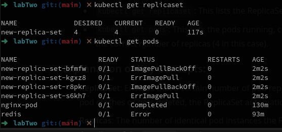
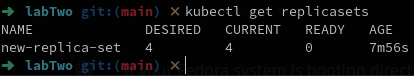
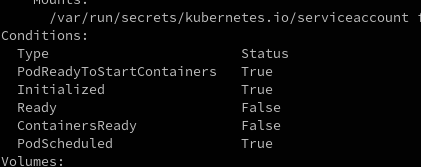
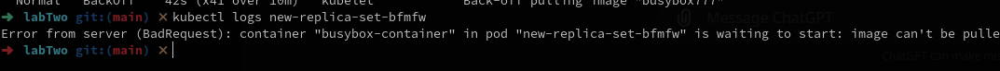
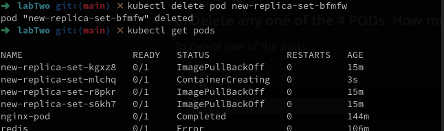
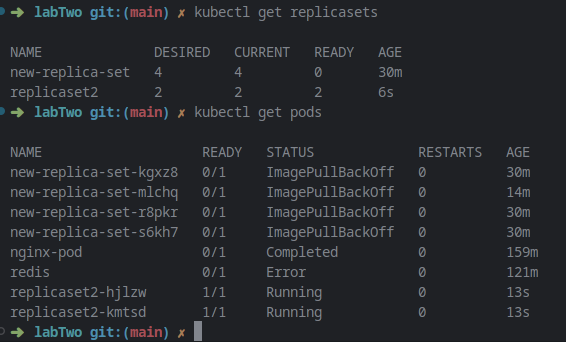

### 1-Create a ReplicaSet using the below yaml

YAML configrations:

```yaml
apiVersion: apps/v1 
kind: ReplicaSet
metadata: 
	name: new-replica-set 
	namespace: default
spec: 
	replicas: 4 
	selector: 
		matchLabels: 
			name: busybox-pod
	template: 
		metadata: 
			labels: 
				name: busybox-pod
		spec: 
			containers:  
			  - name: busybox-container 
				image: busybox777 
				imagePullPolicy: Always 
				command:
				- sh 
				- -c 
				- echo Hello Kubernetes! && sleep 3600
```


### 2. How many PODs are DESIRED in the new-replica-set?

```
spec: 
  replicas: 4
```
is set to 4
### 3. What is the image used to create the pods in the new-replica-set?

```
containers:
  - image: busybox777
```

busybox777
### 4. How many PODs are READY in the new-replica-set?

run
```
kubectl get replicasets
```

answer: 0
### 5. Why do you think the PODs are not ready?

run
```
kubectl describe pod <pod-name>
```
under ready is false

run
```
kubectl logs <pod-name>
```

server error so it's a bad request

### 6. Delete any one of the 4 PODs. How many pods now?


still there is 4 pods after deleting one!

### 7. Why are there still 4 PODs, even after you deleted one?

ReplicaSets ensure that the desired number of pods is maintained. When you delete one of the pods, the ReplicaSet detects the discrepancy (because the number of replicas is now less than 4) and creates a new pod to maintain the desired number of replicas (which is 4 in this case).

### 8. Create a ReplicaSet using the provided YAML (Fix the issue)

The issue in the provided YAML file is in the **apiVersion**. A **ReplicaSet** should use the `apps/v1` API version, not `v1`. Let's correct the YAML and use the right version.

Here is the corrected line:
```
apiVersion: apps/v1
```

now to create the ReplicaSet

